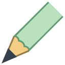
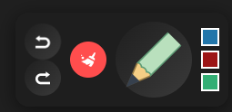
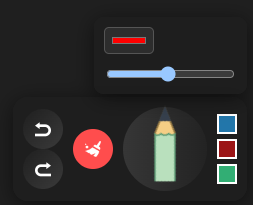
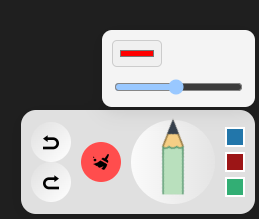
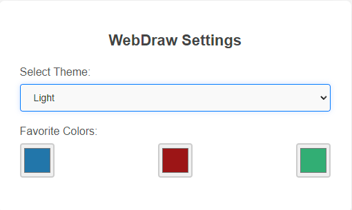

# WebDraw

**WebDraw** is a versatile Chrome extension that lets you draw directly on any webpage. Whether for annotations, sketches, or highlighting key elements, WebDraw provides a smooth and user-friendly drawing experience right within your browser.

## Key Features

- **Draw Anywhere**: Activate drawing mode on any webpage instantly with a single click.
- **Customizable Drawing Tools**: Choose from different colors and adjust line thickness to suit your needs.
- **Undo/Redo**: Correct mistakes easily with built-in undo and redo functionality.
- **Persistent Canvas**: Your drawings stay intact even if you refresh the page, making WebDraw perfect for annotations.
- **Quick Controls**: Access color and thickness settings from a sleek control panel.
- **Light and Dark Themes**: Adaptive themes that seamlessly blend with your preferred browser mode.

## Getting Started

### Installation

#### Install from Chrome Web Store

You can easily install the extension directly from the [Chrome Web Store](https://chromewebstore.google.com/detail/webdraw/your-extension-id).

#### Manual Installation Using CRX File

1. Download the latest release CRX file from the [Project page](https://github.com/firatkaanbitmez/chrome-webdraw-extension/releases).
2. Open Chrome and navigate to `chrome://extensions/`.
3. Enable "Developer mode" by toggling the switch in the top right corner.
4. Drag and drop the downloaded `.crx` file into the `chrome://extensions/` page to install the extension.

#### Install Using Source Code

1. Download the latest release from the [Project page](https://github.com/firatkaanbitmez/chrome-webdraw-extension).
2. Extract the downloaded ZIP file.
3. Open Chrome and navigate to `chrome://extensions/`.
4. Enable "Developer mode" by toggling the switch in the top right corner.
5. Click on "Load unpacked" and select the `Source` folder from the extracted files.

## How to Use

- **Activate Drawing Mode**: Click the WebDraw extension icon to enable drawing mode on any webpage.
- **Customize Your Drawing**: Use the control panel to select colors and adjust the line thickness.
- **Undo, Redo, or Clear**: Easily manage your drawing history using the provided control buttons.
- **Deactivate Drawing Mode**: Click the extension icon again to disable the drawing mode.

## Screenshots

## Error Solutions for Chrome and Edge

If you encounter the following error during installation:

**EN**: "This extension is not from any known source, and may have been added without your knowledge."

**TR**: "Bu uzantı, bilinen herhangi bir kaynaktan değil ve bilginiz dışında eklenmiş olabilir."

Follow these steps to resolve the issue:

1. Run the `fix.bat` file located in the project folder as an administrator. This will adjust the necessary Windows Registry settings to support the installation of the extension.
2. The browsers will be restarted automatically upon completion.

## Development

To build and test the extension locally:

1. Navigate to the `Source` folder in your terminal.
2. Use the `fix.bat` script to register the extension and restart browsers.

## Configurable Options

Customize your experience on the options page with settings like:
- **Color and Thickness**: Set default drawing tools to your preferred values.
- **Theme Selection**: Switch between light and dark themes.
- **Shortcut Preferences**: Customize keyboard shortcuts for a smoother workflow.

## Contributing

We welcome contributions! If you have ideas or improvements, please fork the project, implement your changes, and submit a pull request.

## Development Tools

Built with:
- **HTML/CSS** for the control panel and user interface.
- **JavaScript** for drawing logic and interaction handling.
- Chrome's **scripting**, **storage**, and **notifications** APIs for enhanced control and data management.

## Feedback and Support

Got feedback or need help? Reach out via [email](mailto:firatbitmez.dev@gmail.com).

## License

**WebDraw** is made available under the MIT License. See the [LICENSE.md](LICENSE.md) file for full details.
